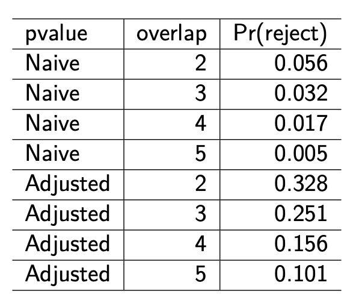

```{r setup, include=FALSE}
options(htmltools.dir.version = FALSE)
knitr::opts_chunk$set(fig.retina = 3, warning = FALSE, message = FALSE)
options(knitr.table.format = "html")
```

```{r xaringan-themer, include=FALSE, warning=FALSE}
library(xaringanthemer)
style_duo_accent(
  primary_color = "#2d708e",
  secondary_color = "#230433",
  link_color = "#55c667",
  text_bold_color = '#f68f46',
#  title_slide_text_color = "#444444",
  title_slide_background_color = "#ffffff", #"#042333",
  title_slide_background_image = "../../../files/theme/LSE/LSEcrest_large.jpg",
  title_slide_background_size = "cover",
  ) #or contain
```

```{r xaringanextra, include=FALSE, warning=FALSE}
#library(xaringanExtra)
#xaringanExtra::use_animate_all("slide_left")
#xaringanExtra::use_tile_view()
#xaringanExtra::use_panelset()
#xaringanExtra::style_panelset_tabs(font_family = "inherit")
```

```{r tidyverse, include=FALSE, warning=FALSE}
library(tidyverse)
library(ggthemes)
library(knitr)
theme_set(theme_minimal(base_size = 22))
set.seed(1)
library(broom)
library(modelr)
```

<style type="text/css">
.remark-slide-content {
    font-size: 1.2rem;
    padding: 1em 4em 1em 4em;
}
</style>

---

### High level intro

### Concluding thoughts

---


## Regression example: F-tests (of unselected variables)


- Regression models $E[Y] = X_A \beta_A$ for some subset $A$ of columns of a matrix $X$.
- With nested subsets $A \subsetneq A'$, we'll conduct an $F$-test and consider this as a goodness-of-fit test for the model with variables $A$.
- In `R` we just use the `anova` function with these two linear models.
- Econometrics: model specification test, omitted/included variable bias


The distribution of the $F$-statistic is derived, of course, under the assumption that $A$ and $A'$ have been chosen *a priori*

---

### High-dimensional setting
When many predictors are available, we often use (automated) model selection procedures like forward stepwise or the LASSO (Tibshirani, 1996) to choose a "good" subset


## Regression variable selection


- For concreteness, consider selecting variables using forward stepwise with BIC, i.e. in `R` with `step(..., k = log(n))`.
- Simulation with $n = 100$ observations of $p = 10$ variables, the first two coefficients are larger than the next 3, and the last 5 are all 0.
- In this (low-dimensional) example, we'll take $A' = \{ 1, \ldots, 10 \}$ for simplicity.
- Consider the $F$-test as a goodness-of-fit test for the selected $A \subset A'$, and compute both unadjusted (classical) and adjusted (selective) p-values.

---

## Profile of model selection events
  

<embed src="fstepbic2.pdf" type="application/pdf">

## Distributions of $p$-values for full-model $F$-tests
  \centering
  \begin{figure}
  \includegraphics[width=.99\textwidth]{fdists_both2}
  \end{figure}

---

## Probability of rejection

\begin{table}

\caption{\label{tab:1}Probability of rejection at level 0.1, conditional on size of overlap}



\end{table}

---

## Conditional power

\begin{table}

\caption{\label{tab:}Probability of rejection at level 0.1, conditional on overlap less than 5}
\centering
\begin{tabular}[t]{l|r}
\hline
pvalue & Pr(reject)\\
\hline
Naive & 0.022\\
\hline
Adjusted & 0.186\\
\hline
\end{tabular}
\end{table}

## Model selection bias

- Model selection bias invalidates many hypothesis tests
- Previously, **significance** of selected variables: **anti-conservative**
- This work on **goodness of fit** tests: **conservative**
- *Conditional on selecting wrong model, goodness-of-fit tests have low power*

Intuitively obvious: use the data to pick the model, and then use the same data to answer "does this model fit the data?"

\ 

Next: one solution approach (used to compute adjusted p-values in regression example)

---

# Post-selection inference

---

## Conditioning on selection

- $M = M(y)$ model selection (e.g. marginal screening, forward stepwise)
- Observe $M = m$
- Test $H_0(m)$ with statistic $T$ conditioned on $\{ y : M(y) = m \}$

**Selective type 1 error** (Fithian, Sun, Taylor, 2014)

Reject $H_0(m)$ if $T > c_{\alpha}(m)$, where

$$P_{H_{0}(m)}(T > c_\alpha(m) \mid M = m) \leq \alpha$$


In practice we may also condition on other things (sufficient statistics for nuisance parameters)

Growing literature (including e.g. details of truncation regions) for various selection methods in various settings

---

##  Related literature

- Early works by Olshen (1973), Hurvich & Tsai (1990), Benjamini & Yekutieli (2005) used basic idea of conditioning to adjust for selection

- Methods controlling FDR or similar: "Screen & clean" Wasserman & Roeder (2009), "Stability selection" Meinshausen & Bühlmann (2010), an Empirical Bayes approach Efron (2011), "SLOPE" Bogdan et al. (2014), and "Knockoffs" Barber & Candès (2015)

- Controlling type 1 error: Debiasing methods Bühlmann (2013); Javanmard & Montanari (2014); Zhang & Zhang (2014), Causal inference for univariate treatment Belloni et al. (2014), PoSI: simultaneous for all submodels Berk et al. (2013), Impossibility results: Leeb & Pötscher (2005, 2006)

---

## More closely related literature

- Lasso, sequential Lockhart et al. (2014)
- General penalty, global null, geometry *Taylor et al. (2015)*; Azaïs et al. (2015)
- Forward stepwise, sequential *Loftus & Taylor (2014)*
- Matrices: PCA/CCA Choi et al. (2014)
- **Fixed $\lambda$ Lasso / conditional Lee et al. (2015)**
- Framework, optimality Fithian et al. (2014)
- Forward stepwise and LAR Tibshirani et al. (2014)
- Unknown $\sigma^2$ *Tian et al. (2018)*; Gross et al. (2015)
- **Group selection / unknown $\sigma^2$ *Loftus & Taylor (2015)* **
- Cross-validation Tian & Taylor (2015); *Loftus (2015)*; Markovic et al. (2017)

---

# Selective unbiasedness
 
---

## When the best isn't good enough

- We've seen a few examples but it should be clear there are far more we haven't mentioned
- Many combinations of model selection procedures and goodness of fit tests (or other diagnostics)
- In many such examples, such a test has power less than $\alpha$ conditional on selecting the wrong model

Pretty troubling! Goodness-of-fit tests worse at detecting the wrong model has been selected than just tossing an $\alpha$-coin... What can we do?

---

## Selective unbiasedness

**Selective unbiasedness** (Fithian, Sun, Taylor, 2014)}
We say that a test is selectively unbiased if for any selected model $m$ and alternative hypothesis $H_1(m)$,
$$P_{H_1(m)}(\text{reject } H_0 | M = m) \geq \alpha$$

We achieve this by using the conditional (truncated) distribution of the test statistic (if we can derive/compute it). *Same method used to control selective type 1 error will make (some) goodness-of-fit tests selectively unbiased*

---

## Marginal screening example

Consider a simpler problem of selecting marginal effects. From many independent effects, screen out those with small observed values, i.e. select those with large values (in this case bigger than 1)

```{r cache=TRUE}
Z <- rnorm(10000)
unselected_Z <- data.frame(Z = Z[abs(Z) < 1])
```

These are generated under the global null, and $Z : |Z| > 1$ are selected. How can we test the "goodness of fit" of selecting these effects? Test based on unselected effects.

---

#### Conditional null distribution is truncated: $Z | |Z| < 1$

```{r mysize=TRUE, size='\\footnotesize',}
truncated_Z_pdf <- function(z) dnorm(z)/(pnorm(1)-pnorm(-1))
# plot code hidden
```

```{r echo=F, cache=TRUE}
ggplot(unselected_Z) +
  geom_histogram(bins = 70, aes(x = Z, y = ..density..)) + xlim(-2, 2) +
  stat_function(fun = truncated_Z_pdf, xlim = c(-1, 1), linetype  = 2) +
  stat_function(fun = dnorm, linetype  = 1) +
  theme_tufte()
```

---

### Interpretation/storytelling

- Keep model selection and inference compartmentalized

- The procedure/algorithm selects model $m$, this is evidence in favor of the model

- If model $m$ contains variable $j$, this is evidence in favor of variable $j$

- We may still fail to reject the null hypothesis that $\beta_{m,j} = 0$, "the best model includes this variable but we cannot reject the null for it"

- Or we may reject the goodness of fit null: "this is the best model (in the class) but it still has specification problems"

"This is the best model we could find, and these inferences may be useful for understanding its limitations and directing future study"

---

## Follow-up study after Benjamini-Hochberg

**Idea**: after using the BH(*q*) procedure to select a subset of hypotheses while controlling the false discovery rate, decide whether to conduct a follow-up study of the hypotheses that were *not* selected

Use the conditional distribution of the non-rejected $p_{(j)}$ to adjust e.g. Fisher's combination test

Interesting meta-analysis implications

---

## Power of Fisher's combination test

\begin{table}

\caption{\label{tab:1}Probability of rejection at level 0.05 with different Beta($1, \mu$)}

\centering

\begin{tabular}{cccc}

{$\mu$ } & {$p_{1|0}$} & unadjusted & adjusted\\

 \hline

 10 &  97 &1.0000 &1.0000\\

20  & 87 &0.9614 &1.0000\\

 30  & 60& 0.5091 &0.9838\\

 40   &33 &0.0900 &0.8580\\

 50  & 19 &0.0040 &0.6080\\

 60  & 11 &0.0000 &0.3320\\

70   & 6& 0.0000 &0.2004\\

  80   & 4& 0.0000& 0.1245\\

90   & 3& 0.0000 &0.0995\\

\end{tabular}

\end{table}

\small{$p_{1|0}$ denotes the average proportion of true nonnulls that are not rejected}

---

# Conclusion

---

## The "quiet scandal" in statistics (Leo Breiman)

People use the data to make modeling choices

This can bias (all sorts of) inferences

Conditioning on those choices and using truncated distributions is a simple idea with wide applicability

## Thank you!

Preprint should be posted soon, more procedures added to `selectiveInference` package on CRAN as we progress.


[joshualoftus.com](joshualoftus.com)
